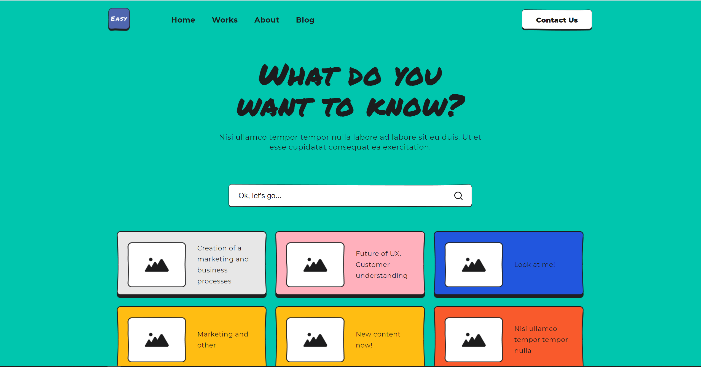

<p align="center">

  <a href="https://nuxtjs.org/">
    
  </a>

  <a href="https://strapi.io/documentation/developer-docs/latest/getting-started/introduction.html">
    
  </a>
</p>

<h1 align="center">
    
</h1>

<h4 align="center"> 
	🚧  In development 🚀 🚧
</h4>

<p align="center">
 <a href="#-about-project">About</a> •
 <a href="#-futures">Futures</a> •
 <a href="#-layout">Layout</a> • 
 <a href="#-how-to-run-the-project">How to run the project</a> • 
 <a href="#-Techs">Techs</a> • 
</p>

## 💻 About

<p align="center"> This repository is being used as an example for creating projects using Nuxt and Strapi, This repo comes in a couple folders, initially we start up with 2, Nuxt and Strapi</p>

---

## 🎨 Layout

The application layout is available on Figma:

<a href="https://www.figma.com/file/mjOHjo7J2MFG40j3RRSH9a/EasyFrame-3.0-Community?node-id=0%3A2786
">

</a>

## 🚀 How to run the project

This repo is divided into two parts:

1. Nuxt (folder web)
2. Strapi (folder Headless CMS)

💡 Nuxt needs Strapi to be running to work

### Prerequisites

Before you begin, you will need to have the following tools installed:
[Git](https://git-scm.com), [Node.js](https://nodejs.org/en/).

#### 🎲 Running the Strapi

Strapi is a flexible, open-source Headless CMS that gives developers the freedom to choose their favorite tools and frameworks while also allowing editors to easily manage and distribute their content.

```bash

# Clone this repo
$ git clone git@github.com:brunosfreitas/nuxt-strapi.git

# Access the project folder in the  cmd / terminal
$ cd strapi

# Install the dependencies
$ npm install

# Strapi build
$ npm build

# Run the application in development mode
$ npm run develop

# The server will start on the port:1337 - access http://localhost:1337/admin

```

#### 🧭 Running Nuxt (Frontend)

```bash

# Clone this repo
$ git clone git@github.com:brunosfreitas/nuxt-strapi.git

# Access the project folder in the  cmd / terminal
$ cd nuxt

# Install the dependencies
$ npm install

# Run the application in development mode
$ npm run dev

# The application will start on the port:3000 - access http://localhost:3000

```

## 🛠 Techs

The following tools were used in the construction of the project:

#### **Nuxt** [Nuxt](https://nuxtjs.org/)

> See the file [package.json](https://github.com/brunosfreitas/nuxt-strapi/blob/50d4c998b8e9abc59d85e145f7013ef2541cb85b/nuxt/package.json)

#### **Strapi** [Strapi](https://strapi.io/)

> See the file [package.json](https://github.com/brunosfreitas/nuxt-strapi/blob/d9ba91ca204898213b22f31e3eec1bffb6702473/strapi/package.json)

- Prototype: **[Figma](https://www.figma.com/)** → **[Prototype (Example)](https://www.figma.com/file/mjOHjo7J2MFG40j3RRSH9a/EasyFrame-3.0-Community?node-id=0%3A2786)**

## 👨‍💻 Contributors

<table>

  <tr>
    <td align="center"><a href="https://github.com/geovanesantana">
    <br /><sub><b>Geovane Santana</b></sub></a><br /><a href="https://github.com/geovanesantana" title="">👨‍🚀</a></td>
    <td align="center"><a href="https://github.com/elainemattjevt">
     <br /><sub><b>elainemattjevt</b></sub></a><br /><a href="https://github.com/elainemattjevt" title="">👨‍🚀</a></td>
    
    
  </tr>
</table>

## 🦸 Autor

<a href="https://github.com/brunosfreitas">
 
 <br />
 <sub><b>Bruno Freitas</b></sub></a> <a href="https://github.com/brunosfreitas" title="">🚀</a>
 <br />
